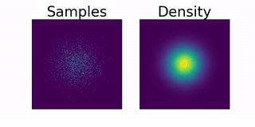

## FFJORD Lite: a minimal working example of Free-Form Jacobian of Reversible Dynamics

Ffjord was introduced in:
> Grathwohl, W., Chen, R. T., Betterncourt, J., Sutskever, I., & Duvenaud, D.
> (2018). Ffjord: Free-form continuous dynamics for scalable reversible
> generative models. arXiv preprint arXiv:1810.01367.
> https://arxiv.org/abs/1810.01367

This a single-file implementation of Ffjord meant to highlight the basic ideas.
Notation is consistent with the preprint. Most of the code is copied from the
original [Ffjord repo](https://github.com/rtqichen/ffjord).

#### Usage
```
$ python script.py
```

#### Dependencies
* [PyTorch](https://pytorch.org)
* [torchdiffeq](https://github.com/rtqichen/torchdiffeq)

#### Example Output

<p align="center">

</p>
